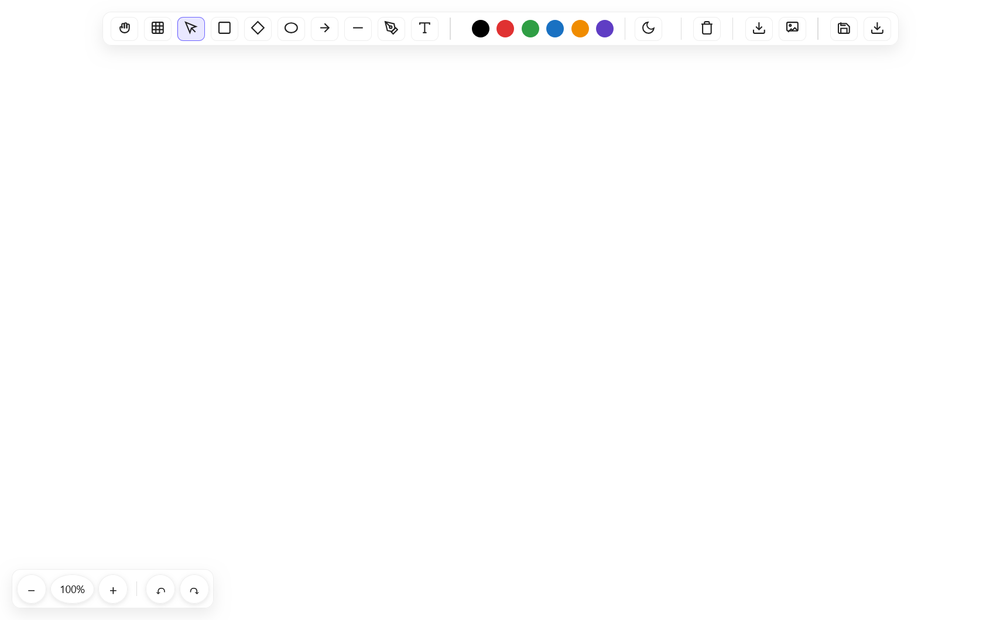

<!-- <p align="center">
  
</p> -->

<h1 align="center">OpenDraw-APT</h1>
<h3 align="center">
  (<a href="https://github.com/SinghArindam/OpenDraw-APT" target="_blank">GitHub</a> | 
  <a href="https://singharindam.github.io/OpenDraw-APT/index.html" target="_blank">Demo</a>)
</h3>
<p align="center">
  <em>A lightweight, offline-first, sketchy diagramming app inspired by Excalidraw</em>
</p>

<p align="center">
  <a href="https://github.com/SinghArindam/OpenDraw-APT/stargazers">
    
  </a>
  <a href="https://github.com/SinghArindam/OpenDraw-APT/network/members">
    
  </a>
  <a href="https://github.com/SinghArindam/OpenDraw-APT">
    
  </a>
  
  
  
</p>


> Trying to make a clone of Excalidraw but in my style and for my use case.





## 📑 Table of Contents
- [About the Project](#-about-the-project)  
- [Features](#-features)  
- [Tech Stack](#-tech-stack)  
- [Getting Started](#-getting-started)  
- [Usage](#-usage)  
- [Configuration](#-configuration)  
- [Deployment](#-deployment)  
- [Project Roadmap](#-project-roadmap)  
- [Contributing](#-contributing)  
- [Testing](#-testing)  
- [FAQ](#-faq)  
- [Acknowledgements](#-acknowledgements)  
- [License](#-license)  
- [Security](#-security)  
- [Changelog](#-changelog)  
- [Contact & Support](#-contact--support)  

---

## 📖 About the Project
**OpenDraw-APT** is a minimal, fast, and offline-capable canvas drawing app.  
It focuses on pragmatic diagramming with a **hand-drawn aesthetic**, keeping the code simple and dependency-light.  

It’s ideal for:
- Quick flows  
- Wireframes  
- UML-ish diagrams  
- Whiteboarding sessions  

The app is a **single-page static site**. Just open `index.html` and draw — no build step required.

---

## ✨ Features
- Hand-drawn style shapes powered by Rough.js  
- Tools: Select, Rectangle, Diamond, Ellipse, Arrow, Line, Free Draw, Text, Hand/Pan  
- Marquee selection and multi-select  
- Infinite world-space grid with toggle  
- Zoom in/out with persistent viewport state  
- Undo/Redo history  
- Theme toggle (Light/Dark)  
- Color palette with quick-pick swatches  
- Save/Load drawings as JSON  
- Export canvas as PNG or JPG  
- Clear canvas button  
- Keyboard-first workflow with hotkeys  

---

## 🛠 Tech Stack
- **Languages**: HTML5, CSS3, JavaScript (ES6+)  
- **Rendering**: HTML5 Canvas  
- **Libraries**: [Rough.js](https://roughjs.com)  
- **Hosting**: GitHub Pages, Netlify, Vercel, etc.  

---

## ⚙ Getting Started
**OpenDraw-APT** is a static web app — no backend, no build. You can run it directly.

### Option A:  
Double-click `index.html` to open in your browser.  

### Option B:  
Serve locally (recommended for best permissions):  
```bash
npm i -g http-server
http-server -p 8080
````

Then open [http://localhost:8080/index.html](http://localhost:8080/index.html)

### Prerequisites

* A modern browser (Chrome, Edge, Firefox, Safari)
* Internet access only for the Rough.js CDN (or vendor it locally for offline-only)

---

## 📂 Project Structure

```
OpenDraw-APT/
 ├── index.html   # Entire app (styles, toolbar, canvas, logic)
 ├── README.md    # Primary README for GitHub
 └── LICENSE      # Apache 2.0
```

---

## 🚀 Usage

All actions take place on the canvas. The floating toolbar provides tools and actions.

### Hotkeys:

* **Select** (V)
* **Hand/Pan** (H)
* **Toggle Grid** (G)
* **Rectangle** (R), **Diamond** (D), **Ellipse** (E)
* **Arrow** (A), **Line** (L)
* **Free Draw** (P), **Text** (T)
* **Toggle Theme** (M)

### Zoom & History

* Zoom In/Out buttons in the bottom-left pill
* Undo (↶) / Redo (↷)
* Zoom level indicator shows the current scale

### Save/Load

* **Save (JSON):** Click the Save icon to download a `.json` snapshot
* **Load (JSON):** Click Load and choose a previously saved `.json`

### Export

* Download **PNG/JPG** via toolbar buttons

---

## 🔧 Configuration

Minimal configs in `index.html`:

* Grid spacing: **40 world units**
* History size: **200 snapshots**

---

## 📦 Deployment

Since it’s a static site, deployment is simple.

* **GitHub Pages**: Enable Pages and set source = root directory
* **Netlify / Vercel**: Import repo, no build step, publish root

---

## 🛤 Project Roadmap

* Grouping, alignment, distribution tools
* Layers panel and z-index management
* Snap-to-grid & smart guides
* SVG export
* Image paste & embedding
* Connector routing & arrowhead customization
* Mobile gestures + PWA installability
* Collaborative (multi-user) mode

---

## 🤝 Contributing

Contributions are welcome!

Guidelines:

* Keep the UI simple & responsive
* Avoid heavy dependencies; prefer vanilla JS
* Maintain hand-drawn style consistency
* Add clear comments for non-trivial logic
* Update README & changelog when relevant

---

## 🧪 Testing

Manual testing checklist:

* Verify all tools render at different zoom levels
* Test selection, marquee, and panning
* Ensure undo/redo works with mixed actions
* Save/Load round-trips drawings correctly
* PNG/JPG exports reflect current viewport
* Confirm readability across themes & grid states

---

## ❓ FAQ

**Q: Why can’t I select after panning?**\
A: Make sure **Hand tool (H)** is off and **Select tool (V)** is active.

**Q: Can I run it fully offline?**\
A: Yes, vendor Rough.js locally and remove CDN reference.

**Q: Where are files stored?**\
A: Saves are **downloaded as JSON** — no server storage.

---

## 🙏 Acknowledgements

* Inspired by [Excalidraw](https://excalidraw.com)
* Sketchy rendering by [Rough.js](https://roughjs.com)

---

## 📜 License

Distributed under the **Apache 2.0 License**.
See [LICENSE](LICENSE) for details.

---

## 🔐 Security

If you discover a vulnerability, please **report privately** (e.g., email) instead of opening a public issue.

---

## 📝 Changelog

### v1.7 — 2025-09-27

* Marquee selection
* Improved selection boxes
* Refined theme toggle icon
* Stability improvements to undo/redo stacks
* Export to JPG alongside PNG
* UI polish & accessibility tweaks
* Documentation overhaul

### v1.6 — 2025-08-10

* Added Save/Load as JSON
* Introduced bottom-left zoom pill with zoom level
* Persisted viewport in snapshots
* Performance tuning for grid rendering

### v1.5 — 2025-07-01

* Added PNG export
* Color palette quick-swatches
* Improved hit-testing
* Minor toolbar refinements

### v1.4 — 2025-06-10

* Theme toggle (light/dark)
* Consistent CSS variables
* Shadow and border design system

### v1.3 — 2025-05-20

* Added Ellipse and Diamond tools
* Upgraded Rough.js
* Improved stroke scaling at zoom levels

### v1.2 — 2025-04-28

* Arrow and Line tools
* Basic selection visuals
* Grid toggle

### v1.1 — 2025-04-10

* Free Draw (pencil) & Text tool
* Toolbar hotkeys
* Clear canvas action

### v1.0 — 2025-03-18

* Initial release: canvas foundation, pan/zoom, Rectangle tool, basic undo/redo

---

## 📬 Contact & Support

Maintainer: **Arindam Singh**

* 🌐 [Project Repo](https://github.com/SinghArindam/OpenDraw-APT)
* 🐛 [Issues](https://github.com/SinghArindam/OpenDraw-APT/issues)

---
